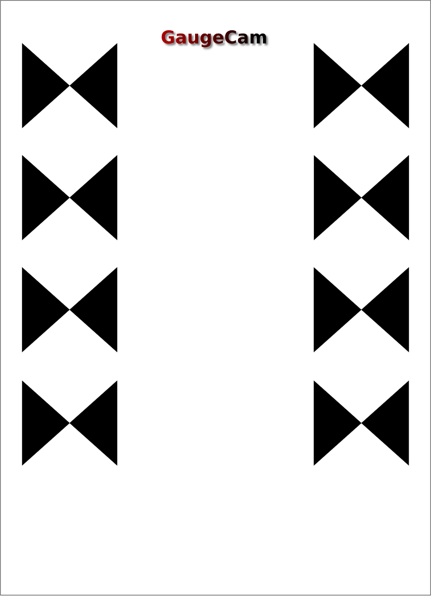

```{r setup, include=FALSE, echo=FALSE} 
library(plyr)
library(MASS)
library(fitdistrplus)
library(pastecs)
library(readr)

par(mar = c(4.5, 4.5, 3.5, 1.5))
# this chunck sets up some of the common setting for all the document later on.
# The first line below sets the figure default sizes, figures will be aligned, that the R code does not appear (echo=FALSE), and that the 
# warning messages should not show up

#knitr::opts_chunk$set(fig.height=5, fig.width=9, fig.align="center", echo = FALSE, warning=FALSE)

# I found this function that loads a list of packages using 'library', and installs them if they are not installed. 
#ipak <- function(pkg){
#    new.pkg <- pkg[!(pkg %in% installed.packages()[, "Package"])]
#    if (length(new.pkg)) 
#       install.packages(new.pkg, dependencies = TRUE)
#    sapply(pkg, library, character.only = TRUE)
#}

# usage
#packages <- c("knitr", "captioner", "stringr", "devtools", "bookdown","kableExtra")
#ipak(packages)
```

```{r echo=FALSE, include=FALSE}
rmarkdown::default_output_format(knitr::current_input())$name
```

# Abstract

# Introduction

- Much of what we know in hydrology today takes root at one point in the ability to observe and record on a near continuous basis the rapid changes in water stages in rivers, lakes, and estuaries
- To this day, most of flow rates calculated in the thousands of hydrologic stations around the world are still calculated from the water level or stage measurements.
- Since the first hydrological station installed on the Mississippi river in the 1880s, there have been many devices installed to record water stages
    - The mechanisms to measure stages used until now have included fully mechanical pulley and float based systems, pressure transducers immerserd in water, pressure transducers in air in equilibrium with the water column or bubblers, radar systems, ultrasonic systems placed above or under the water. 
- In all these systems there is an intermediate operation between the raw signal and the stage values recorded. In other words the raw signals always require interpretation before a number is assigned to a measurement and all measurements are essentially indirect. 
- For example, a popular system is the mechanical vertical movements of a float transfered to a pulley, which rotation is recorded as a voltage via a potentiometer, i.e., the raw signal in this case. Stage measurements recorded are calculated internally by the instrument via a rating equation which correlates voltage with real world stage values. The reliability and accuracy of the stage measurements thus depend on the stability of the actual volatage to stage relationship such that the calibration rating equation may still apply. 
- In all past and current systems, the interpretation of the raw signal was and is done internatlly by instruments in the field.
- Because of wear with time and of the variable temperature and moisture conditions where the instruments are installed, the actual relationship between the water level and the raw signal may drift over time (e.g. float weigh may change because of biofilm growth on it; membrane of a pressure transducer diforms over time, etc.), and/or the interpretation system of the raw signal also drifts (e.g., potentiometer).
- In all cases, regular calibrations are required to maintain the quality of stage measurements. But because the interpretation of the raw data is done in the field, the calibration must also be done in the field, which means that qualified personel must go to the field at regular intervals (monthly or more often).
- Among new technologies, image-based measurement systems offer the enormous advantage of having 
- Additionally, none of the existing system provide means to independently verify data
- The GaugeCam image based systems provides solutions to the drawbacks of existing systems: the interpretation of the raw data is performed remotely, on a server, and the raw data itseld can be reinterpreted at any times and can be visually verified. 
- The obvious advantages are that maintainance does not require highly qualified personnel, and the timing for maintainance can be detected by the user (e.g., seen in the raw data itself, i.e., in the image), and every single measurement is visually verifiable. 
- This means that the system can be installed virtually anywhere in the world where a cell phone connection is possible for live measurements
- The GaugeCam system uses images streaming from the field at a high frequency basis to a server where the images are analyzed and a water level measurement made. The system then stores both the measurement and the images corresponding to each measurement.
- The article reports the field performance and calculates the uncertainty of the system in the field

In hydrology, it is an important problem to study how the river water level varies across time. As it is difficult to observe some time series data at different locations of the river manually, a device called GaugeCam is often used which captures images of the water level once in every 15 minutes. In every image, there is a scale reading that can be visually read from the images and it is considered to be the true value. The device also reports a value to the server automatically. We call the difference between the automatically reported value and the true value, i.e. the bias to be the ``GaugeCam error". Besides the issues of malfunctioning of the instrument, there are several possible micro-scale physical factors which can affect the bias, e.g. whether the observations are obtained during the daytime or at night because of the difference in the light diffraction. We test the significance of such factors on the GaugeCam error. We calculate 70\%, 80\%, 90\% and 95\% confidence intervals of the bias values separately under different physical conditions. 
Instead of partitioning the data into classes, we adjust the study design in terms of indicators which alleviates the loss of information issues as well as consider the time series structure which makes our study more realistic.

It is an important problem in hydrology to study how the river water level varies across time particularly from the agricultural point of view. Often a river to be studied has a very long stretch and to measure the water level quite accurately across the river, the experimenter needs to observe multiple time series sequences at various geographical locations of the river. In practice it is a very difficult task to do and a device called GaugeCam is often used to observe the water level automatically. The device captures images of the water level once in every 15 minutes. In every image, there is a scale reading that can be visually read from the images which is considered to be the true value and the device also reports a value to the server automatically. The success of the instrument can be accessed in terms of the difference between the automatically reported value and the true value, i.e. the bias to be the ``GaugeCam error". One possible reason behind the high bias is the malfunctioning of the instrument which is possible because of several reasons, e.g. very high tide, very strong wind, high rainfall etc. Besides these, there are several possible micro-scale physical factors which can affect the bias, e.g. whether the observations are obtained during the daytime (between 8:30 AM and 5:45 PM) or at night (between 7:45 PM and 4:30 AM next day), whether the actual water level is high or small etc. 

\subsection{Motivation}
Identifying the physical factors and considering them into the study is very important for any statistical analysis and hence before delving deeper into the statistical formulation, we discuss the sources of variability. The measurements really depend on the effect of the light diffraction at the meniscus when water touches the flat background, and the interpretation of the camera to define the gray level in each pixel of the pictures. Consequently, we expect that the measurements should somewhat vary, and therefore the errors are dependent on the angle between the lighting angle (sun or infrared illuminator), and the light intensity (the camera interprets the pixels differently during daytime and night time). Because of the optical distortion due to the lenses, there is more distortion when the measurements are done at a larger angle compared to the horizontal line. In our case, when the measurements are low (e.g., less than 30 cm), the angle is higher compared to the case when the measurements are high (greater than 70 cm). Also, for the night pictures, a mechanical filter does come on and off, which creates very small movement of the camera. There is an in-built software that corrects it as it overlays all the images onto a reference one before it does the analysis, but this is done on a one pixel resolution, which in our case is about 2.5 mm, or any general error that we estimated using very crude initial analysis. In other words, even if this correction is good, it does add its own error which motivates us to evaluate it.


# Method

## Measurement principles

- The first principle is that water forms a very crisp water line on a white or light grey colored vertical target plan installed in a water body. This is particularly visible in an image taken in the general horizontal direction towards the target.  Because of the light absorption of water (even if it is transparent), the pixels in such an image corresponding to water have a dark shade, and usually much darker than those of the vertical light colored (white or very light grey) background used as a target. The sharp contrast in the pixel grey scale above and below the water line is used for automatic detection of the water line.
- From our previous paper:

> Water level detection is performed with a machine vision tool called an edge detector [e.g., @Mare1980-kl; @Torre1986-ez]. On a defined area of an image where the water level draws a line against a flat background, each pixel column is scanned from top to bottom to detect sharp changes in the pixels gray scale using a non-parametric kernel tool. The sharpest gradients are saved as possible indicators of the water surface. The points for all the strong gradients in each column of an image are then evaluated to determine which set of those gradients best fit the expected angle of the water line (based on the rotation of the camera). Considerable amount of work is performed to ignore anomalous points,
false lines, glint, etc. The best linear fit for the detected points is considered to be the water line. Interestingly,
this line’s equation is expressed in pixel coordinates and may fall ‘between’ two pixels, resulting in sub-pixel resolution of the measurements.

- The second principle of the GaugeCam system is the ability to automatically translate the location of the water line expressed in the pixel coordinates into real world coordinates. For this, the GaugeCam system uses a set of eight bow ties shaped fiducials placed in two columns of four rows, and leaving a blank column between the two column fiducials (Figure \@ref(fig:GC-background)). The GaugeCam software automatically detects the center of the fiducials using blob analysis, which real world coordinates are known. A piecewise linear regression is then used to create the transfer matrix to relate the pixel to the world coordinates. 


</br>

```{r "GC-background", eval=TRUE, echo=FALSE, out.width = '50%', fig.align = 'center', fig.cap="Target background (dimensions 1.2m x 0.9m) with bowties fiducials located in two columns and four rows leaving a blank column in between where the water line is automatically detected"}

```
</br>

## Field site details

- Constructed tidal marsh with diurnal tides of max 1.2m tidal amplitude
- Images obtained over a span of xx months
- Camera type, lense type
- Camera installed at xx m from the background with a x mm lense for a final resolution of yy mm per pixel
- Camera installed a zz m in altitude, and this much higher than the top and bottom of background. At the end, the was this downward angle for the top of the background and this angle for the bottom of the background.
- Insert figure here.
- Maybe we should have an objective measure of the fish eye effect here as well


### Image processing principles

- The reference image
    - Chosen to have all fiducials visible
    - In the reference image, the linear interpolation of the pixel to world coordinates is established.
- All images are first superimposed to the reference image. We have observed that despite the apparent sturdiness of cameras installed in the field, the cameras over time tend to move, shifting images a bit (e.g., one to several pixels). To superimpose all images to the reference image, the top two fiducial centers are matched (exact procedure needs to be explained here).
- 

### Statistical analysis

Motivated by the above scientific reasons, we formulate our problem as a set of statistical hypothesis testings. They are as follows

- Hypothesis 1: Because of the change in the incident light angle, the errors on nighttime and daytime pictures should be significantly different. More accurately, the nighttime pictures should generally overestimate the measurements more than the daytime pictures.
- Hypothesis 2: 
    + 2a) The nighttime measurements should be positively biased.
    + 2b) The daytime measurements should be generally unbiased.
- Hypothesis 3: Because the nighttime pictures have to be corrected more often because of movement, than daytime pictures, the standard deviation of the errors should be larger than those of the daytime ones.
- Hypothesis 4: Because of image distortion, the distribution of errors (bias and standard deviation) for measurements at low stages (less  than 30 cm) should be different than the ones at high stage (greater than 70 cm).


Testing the above hypotheses are quite common in the statistical literature when the observations are assumed to be independent. But the presence of time series correlation makes them complicated. Ignoring the correlated time series structure would make the study quite unreliable; so we consider the structure for all the tests and also describe the tests in such set-ups. Information loss is another issue. For example, for testing Hypothesis 1, the simplest approach would be to choose the daytime observations and the nighttime observations and to perform the tests based on them. But in this way, the observations not falling in any of the categories would not be used and lead to information loss which would make the tests less powerful.  

For the daytime images, the source of the light used is sun while at night it is the infrared illuminator. Because of the different nature of the angular variation in day and night, the only change is due to the changes in stage. Thus, for the daytime and the nighttime measurements those are within 10 cm of the same stage (e.g. three groups of values: included between 15 and 25 cm, 35 cm and 45 cm, 55 cm and 65 cm, and 75 and 85 cm), the corresponding GaugeCam bias are possibly different. This fits the set-up of the Hypothesis 1 along with considering the indicators for the specific cases. To Test Hypotheses 3 and 4, we assume the time series correlation structure is same for all the observations.

#### Data description and pre-processing
A total of 13905 images were collected by GaugeCam between February 09, 2012 08:30AM and July 24, 2012 07:15PM at the time differences of 15 minutes. Correspondingly, for a subset of 1086 images, the actual observations were obtained visually. We assume that the GaugeCam errors of value outside $\pm 2$ cm are due to device malfunctioning possibly due to a heavy wind or a heavy tide etc. and not due to some physical factors we are interested in. Thus, we discard those images and consider the rest of the 1033 images. The scatter plot of the retained GaugeCam erros is provided in the right panel of Figure 1.

As actually they are time series observations, the time series is provided in Figure 1. The observations are not at the same time differences. Particularly there is large time gap between the 529-th and the 530-th image of more than 21 days due to the equipment failure though the same instrument was installed later and hence we do not consider the data to be two separate time series. As it is possible that some bias remains after repairing, we keep an indicator which indicates the change point, i.e. it takes value 1 after repairing and 0 till the 529-th observation. Also we are interested to study the variation of the GaugeCam error with the true water levels, ignoring the time series structure, we provide the scatter plot in Figure 2. %The two images along with the mean levels are provided in Figure 3. Significant difference between the mean levels is clearly observable. We calculate the variograms of GaugeCam errors for these two parts and presented in Figure 4. It is clear from Figure 4 that the observations are correlated and ignoring the time series structure is not recommendable.

```{r "GC-error-TS", eval=TRUE, echo=FALSE, out.width = '100%', fig.align = 'center', fig.cap="Whole time series plot of the GaugeCam errors"}
mydir <- "/Users/francoisbirgand/Google Drive/Publications/2018/GaugeCam_NR/GC-NR-paper/"

setwd(mydir)

visualfile <- "NR_Visual_Data_120201_120724.csv"

gaugecamfile <- "NR_Gaugecam_Data_120201_120724.csv"

visualdata <- read_csv(visualfile)

gaugecamdata <- read_csv(gaugecamfile)

visGCdata <- merge(visualdata, gaugecamdata, 
                   by = intersect("imagename", "imagename"))

names(visGCdata)[3] = "Visual_data"

names(visGCdata)[5] = "GaugeCam_data"

attach(visGCdata)

cleandata <- subset(visGCdata, 
                    (GaugeCam_data-Visual_data<2)&(GaugeCam_data-Visual_data>-2))

par(mfrow = c(1, 2))

plot(Visual_data,GaugeCam_data, main = "before cleaning", 
     xlab = "Visual data", ylab = "GaugeCam data")

plot(cleandata$Visual_data,cleandata$GaugeCam_data, 
     main = "after cleaning", xlab = "Visual data", ylab = "GaugeCam data")
```

```{r "GC-error-vs-VisualDataTS", eval=TRUE, echo=FALSE, out.width = '100%', fig.align = 'center', fig.cap="Time series of the GaugeCam errors versus the Visual data"}
diff_data <-  cleandata$GaugeCam_data - cleandata$Visual_data

par(mfrow = c(1, 1))

exact_date <- strptime(as.character(cleandata$date), format = '%y-%m-%d-%H-%M')

exact_time <- as.POSIXlt(exact_date)$yday + 
  as.POSIXlt(exact_date)$hour / 24 + as.POSIXlt(exact_date)$min / (60 * 24)

exact_time <- exact_time - min(exact_time)

plot(exact_time, diff_data, type = "o", 
     ylab = "GaugeCam error (cm)", xlab = "days (starting point = 0)", ylim = c(-2, 2))
```

```{r "GC-error-vs-VisualData", eval=TRUE, echo=FALSE, out.width = '100%', fig.align = 'center', fig.cap="Scatter plot of the GaugeCam errors versus the Visual data"}
par(mfrow = c(1, 1))

exact_data <- cleandata$Visual_data

plot(exact_data, diff_data, xlab = "Visual data", ylab = "GaugeCam error")

break_point <- (1:length(exact_time))[exact_time[2:length(exact_time)] - 
                                        exact_time[1:(length(exact_time) - 1)] == 
                                        max(exact_time[2:length(exact_time)] - 
                                              exact_time[1:(length(exact_time) - 1)])]

changepoint_indicator <- as.numeric(exact_time > exact_time[break_point])
```

#### Statistical model

```{r cache=TRUE, echo=FALSE}
library(car)

matern_estimates <- function(design_mat, response, time_points){
  
  length_ts <- length(time_points)
  
  dist_mat <- abs(replicate(length_ts, time_points) - t(replicate(length_ts, time_points)))
  
  cov.fx <- function(alpha, nugget = TRUE){
    cov <- alpha[1] * matcor(alpha[2], alpha[3])
    diag(cov) <- diag(cov) + (1 - alpha[1])
    cov}
  
  theta2alpha <- function(theta){
    ratio  <- 1 / (1 + exp(-theta[1]))
    ratio  <- 0.01 + 0.98 * ratio
    range  <- exp(theta[2])
    alpha  <- c(ratio, range)
    smooth <- 0.001 + 99.999 / (1 + exp(-theta[3]))
    alpha  <- c(alpha, smooth)
    alpha}
  
  matcor <- function(range, nu){
    ccc <- 1 / gamma(nu) / 2 ^ (nu - 1) * (dist_mat / range) ^ (nu) * besselK(dist_mat / range, nu)
    ccc[dist_mat == 0] <- 1
    ccc}
  
  mvn.nll <- function(alpha, beta, sigmaSq){
    mean_vector <- c(design_mat %*% beta)
    residual_vector <- response - mean_vector
    C_chol <- chol(sigmaSq * cov.fx(alpha))
    C_inv <- chol2inv(C_chol)
    nll   <- sum(log(diag(C_chol))) + 0.5 * wcrossprod(residual_vector, residual_vector, C_inv)
    nll}
  
  SSE <- function(beta, alpha){
    mean_vector <- c(design_mat %*% beta)
    residual_vector <- response - mean_vector
    C_chol <- chol(cov.fx(alpha))
    C_inv <- chol2inv(C_chol)
    c(wcrossprod(residual_vector, residual_vector, C_inv))}
  
  get.sigmaSq <- function(beta, alpha){SSE(beta, alpha) / length_ts}
  
  get.beta <- function(alpha){
    corr_mat <- cov.fx(alpha)
    corr_mat_inv <- chol2inv(chol(corr_mat))
    c(solve(wcrossprod(design_mat, design_mat, corr_mat_inv)) %*% 
        wcrossprod(design_mat, response, corr_mat_inv))}
  
  comp_like <- function(theta){
    alpha  <- theta2alpha(theta)
    beta   <- get.beta(alpha)
    sigmaSq <- get.sigmaSq(beta,alpha)
    mvn.nll(alpha, beta, sigmaSq)}
  
  init <- c(0, log(max(dist_mat)/4), -3)
  opt <- optim(init, comp_like)$par
  alpha_est <- theta2alpha(opt)
  beta_est <- get.beta(alpha_est)
  sigmaSq_est <- get.sigmaSq(beta_est, alpha_est)  
  
  beta_est
  tauSq_hat <- sigmaSq_est * (1 - alpha_est[1])
  sigmaSq_hat <- sigmaSq_est * alpha_est[1]
  
  rho_hat <- alpha_est[2]
  
  nu_hat <- alpha_est[3]
  
  list(beta_MLE = beta_est, sigmaSq_MLE = sigmaSq_est, 
       tauSq_MLE = tauSq_hat, rho_MLE = rho_hat, nu_MLE = nu_hat)}

#--------------------------------------------------------
design_mat <- cbind(rep(1, length(exact_time)), exact_time, changepoint_indicator)

matern_est <- matern_estimates(design_mat, diff_data, exact_time)
#save(matern_est, file = "matern_parameter_estimates.Rdata")
#--------------------------------------------------------
Date <- strptime(as.character(cleandata$date), format = '%y-%m-%d-%H-%M')
time.indic <- as.POSIXlt(Date)$hour+as.POSIXlt(Date)$min / 100
day.pics <- as.numeric(c(time.indic > 8.30) * c(time.indic < 17.45))
night.pics <- as.numeric(time.indic < 4.30 | time.indic > 19.45)

#--------------------------------------------------------
design_mat_dn <- cbind(rep(1, length(exact_time)), exact_time, 
                       changepoint_indicator, day.pics, night.pics)

matern_est_dn <- matern_estimates(design_mat_dn, diff_data, exact_time)

#save(matern_est_dn, file = "matern_parameter_estimates_dn.Rdata")
#--------------------------------------------------------

indicator_15_25 <- c(cleandata$Visual_data >= 15) * c(cleandata$Visual_data <= 25)
indicator_35_45 <- c(cleandata$Visual_data >= 35) * c(cleandata$Visual_data <= 45)
indicator_55_65 <- c(cleandata$Visual_data >= 55) * c(cleandata$Visual_data <= 65)
indicator_75_85 <- c(cleandata$Visual_data >= 75) * c(cleandata$Visual_data <= 85)

design_mat_dn_15_25 <- cbind(rep(1, length(exact_time)), 
                             exact_time, changepoint_indicator, day.pics, night.pics, 
                             indicator_15_25, indicator_15_25 * day.pics,indicator_15_25 * night.pics)

design_mat_dn_35_45 <- cbind(rep(1, length(exact_time)), 
                             exact_time, changepoint_indicator, day.pics, night.pics, 
                             indicator_35_45, indicator_35_45 * day.pics,indicator_35_45 * night.pics)

design_mat_dn_55_65 <- cbind(rep(1, length(exact_time)), 
                             exact_time, changepoint_indicator, day.pics, night.pics, 
                             indicator_55_65, indicator_55_65 * day.pics,indicator_55_65 * night.pics)

design_mat_dn_75_85 <- cbind(rep(1, length(exact_time)), 
                             exact_time, changepoint_indicator, day.pics, night.pics, 
                             indicator_75_85, indicator_75_85 * day.pics,indicator_75_85 * night.pics)

matern_est_dn_15_25 <- matern_estimates(design_mat_dn_15_25, diff_data, exact_time)

matern_est_dn_35_45 <- matern_estimates(design_mat_dn_35_45, diff_data, exact_time)

matern_est_dn_55_65 <- matern_estimates(design_mat_dn_55_65, diff_data, exact_time)

matern_est_dn_75_85 <- matern_estimates(design_mat_dn_75_85, diff_data, exact_time)

#--------------------------------------------------------
matcor <- function(dist_mat, range, nu){
  ccc <- 1 / gamma(nu) / 2 ^ (nu - 1) * (dist_mat / range) ^ (nu) * besselK(dist_mat / range, nu)
  ccc[dist_mat == 0] <- 1
  ccc}

timedistmat <- abs(replicate(length(exact_time), exact_time) - t(replicate(length(exact_time), exact_time)))

#--------------------------------------------------------

# effect of the change point

cov_mat_est <- matern_est$sigmaSq_MLE * 
  matcor(timedistmat, range = matern_est$rho_MLE, nu = matern_est$nu_MLE) + 
  matern_est$tauSq_MLE * diag(length(exact_time))

beta_hat_cov_inv <- wcrossprod(design_mat, design_mat, chol2inv(chol(cov_mat_est)))

beta_hat_cov <- chol2inv(chol(beta_hat_cov_inv))

coeff_vec <- c(0, 0, 1)

teststat <- c(sum(coeff_vec * matern_est$beta_MLE) / sqrt(wcrossprod(coeff_vec, coeff_vec, beta_hat_cov)))

#--------------------------------------------------------

# difference between day and night

cov_mat_est_dn <- matern_est_dn$sigmaSq_MLE * 
  matcor(timedistmat, range = matern_est_dn$rho_MLE, nu = matern_est_dn$nu_MLE) + 
  matern_est_dn$tauSq_MLE * diag(length(exact_time))

beta_hat_cov_dn_inv <- wcrossprod(design_mat_dn, design_mat_dn, chol2inv(chol(cov_mat_est_dn)))

beta_hat_cov_dn <- chol2inv(chol(beta_hat_cov_dn_inv))

contrast <- c(0, 0, 0, 1, -1)

teststat_dn <- c(sum(contrast * matern_est_dn$beta_MLE) / 
                   sqrt(wcrossprod(contrast, contrast, beta_hat_cov_dn)))


coeff_vec <- c(0, 0, 0, 0, 1)

teststat_dn_2a <- c(sum(coeff_vec * matern_est_dn$beta_MLE) / 
                      sqrt(wcrossprod(coeff_vec, coeff_vec, beta_hat_cov_dn)))

coeff_vec <- c(0, 0, 0, 1, 0)

teststat_dn_2b <- c(sum(coeff_vec * matern_est_dn$beta_MLE) / 
                      sqrt(wcrossprod(coeff_vec, coeff_vec, beta_hat_cov_dn)))
#--------------------------------------------------------

# difference between day and night for visual values between 15 and 25 

cov_mat_est_dn_15_25 <- matern_est_dn_15_25$sigmaSq_MLE * 
  matcor(timedistmat, range = matern_est_dn_15_25$rho_MLE, nu = matern_est_dn_15_25$nu_MLE) + 
  matern_est_dn_15_25$tauSq_MLE * diag(length(exact_time))

beta_hat_cov_dn_15_25_inv <- wcrossprod(design_mat_dn_15_25, design_mat_dn_15_25, 
                                        chol2inv(chol(cov_mat_est_dn_15_25)))

beta_hat_cov_dn_15_25 <- chol2inv(chol(beta_hat_cov_dn_15_25_inv))

contrast <- c(0, 0, 0, 0, 0, 0, 1, -1)

teststat_dn_15_25 <- c(sum(contrast * matern_est_dn_15_25$beta_MLE) / 
                         sqrt(wcrossprod(contrast, contrast, beta_hat_cov_dn_15_25)))

#--------------------------------------------------------

# difference between day and night for visual values between 35 and 45 

cov_mat_est_dn_35_45 <- matern_est_dn_35_45$sigmaSq_MLE * 
  matcor(timedistmat, range = matern_est_dn_35_45$rho_MLE, nu = matern_est_dn_35_45$nu_MLE) + 
  matern_est_dn_35_45$tauSq_MLE * diag(length(exact_time))

beta_hat_cov_dn_35_45_inv <- wcrossprod(design_mat_dn_35_45, design_mat_dn_35_45, 
                                        chol2inv(chol(cov_mat_est_dn_35_45)))

beta_hat_cov_dn_35_45 <- chol2inv(chol(beta_hat_cov_dn_35_45_inv))

contrast <- c(0, 0, 0, 0, 0, 0, 1, -1)

teststat_dn_35_45 <- c(sum(contrast * matern_est_dn_35_45$beta_MLE) / 
                         sqrt(wcrossprod(contrast, contrast, beta_hat_cov_dn_35_45)))

#--------------------------------------------------------

# difference between day and night for visual values between 55 and 65 

cov_mat_est_dn_55_65 <- matern_est_dn_55_65$sigmaSq_MLE * 
  matcor(timedistmat, range = matern_est_dn_55_65$rho_MLE, nu = matern_est_dn_55_65$nu_MLE) + 
  matern_est_dn_55_65$tauSq_MLE * diag(length(exact_time))

beta_hat_cov_dn_55_65_inv <- wcrossprod(design_mat_dn_55_65, design_mat_dn_55_65, 
                                        chol2inv(chol(cov_mat_est_dn_55_65)))

beta_hat_cov_dn_55_65 <- chol2inv(chol(beta_hat_cov_dn_55_65_inv))

contrast <- c(0, 0, 0, 0, 0, 0, 1, -1)

teststat_dn_55_65 <- c(sum(contrast * matern_est_dn_55_65$beta_MLE) / 
                         sqrt(wcrossprod(contrast, contrast, beta_hat_cov_dn_55_65)))

#--------------------------------------------------------

# difference between day and night for visual values between 75 and 85 

cov_mat_est_dn_75_85 <- matern_est_dn_75_85$sigmaSq_MLE * 
  matcor(timedistmat, range = matern_est_dn_75_85$rho_MLE, nu = matern_est_dn_75_85$nu_MLE) + 
  matern_est_dn_75_85$tauSq_MLE * diag(length(exact_time))

beta_hat_cov_dn_75_85_inv <- wcrossprod(design_mat_dn_75_85, design_mat_dn_75_85, 
                                        chol2inv(chol(cov_mat_est_dn_75_85)))

beta_hat_cov_dn_75_85 <- chol2inv(chol(beta_hat_cov_dn_75_85_inv))

contrast <- c(0, 0, 0, 0, 0, 0, 1, -1)

teststat_dn_75_85 <- c(sum(contrast * matern_est_dn_75_85$beta_MLE) / 
                         sqrt(wcrossprod(contrast, contrast, beta_hat_cov_dn_75_85)))


```


```{r cache=TRUE, eval=TRUE, echo=FALSE}
#--------------------------------------------------------

corr_mat_est_dn <- cov_mat_est_dn / cov_mat_est_dn[1, 1]

Sigma11 <- cov_mat_est_dn[day.pics == 1, day.pics == 1]

Sigma22 <- cov_mat_est_dn[night.pics == 1, night.pics == 1]

Sigma12 <- cov_mat_est_dn[day.pics == 1, night.pics == 1]

Sigma21 <- cov_mat_est_dn[night.pics == 1, day.pics == 1]

residuals <- diff_data - c(design_mat_dn %*% matern_est_dn$beta_MLE)

residuals_day <- residuals[day.pics == 1]

residuals_night <- residuals[night.pics == 1]

residuals_night_adjusted <- residuals_night - 
  c(Sigma21 %*% chol2inv(chol(Sigma11)) %*% residuals_day)

cov_night_adjusted <- Sigma22 - Sigma21 %*% chol2inv(chol(Sigma11)) %*% Sigma12

teststat_3 <- 
  c(c(wcrossprod(residuals_day, residuals_day, chol2inv(chol(Sigma11))) / sum(day.pics)) / 
      c(wcrossprod(residuals_night_adjusted, residuals_night_adjusted, 
                   chol2inv(chol(cov_night_adjusted))) / sum(night.pics)))

pval <- pf(teststat_3, df1 = sum(day.pics), df2 = sum(night.pics))

pval
#--------------------------------------------------------

design_mat_dn_30_70 <- cbind(rep(1, length(exact_time)), exact_time, 
                             changepoint_indicator, c(cleandata$Visual_data <= 30), c(cleandata$Visual_data >= 70))

matern_est_dn_30_70 <- matern_estimates(design_mat_dn_30_70, diff_data, exact_time)

cov_mat_est_dn_30_70 <- matern_est_dn_30_70$sigmaSq_MLE * 
  matcor(timedistmat, range = matern_est_dn_30_70$rho_MLE, nu = matern_est_dn_30_70$nu_MLE) + 
  matern_est_dn_30_70$tauSq_MLE * diag(length(exact_time))

corr_mat_est_dn_30_70 <- cov_mat_est_dn_30_70 / cov_mat_est_dn_30_70[1, 1]

Sigma11 <- cov_mat_est_dn_30_70[c(cleandata$Visual_data <= 30) == 1, c(cleandata$Visual_data <= 30) == 1]

Sigma22 <- cov_mat_est_dn_30_70[c(cleandata$Visual_data >= 70) == 1, c(cleandata$Visual_data >= 70) == 1]

Sigma12 <- cov_mat_est_dn_30_70[c(cleandata$Visual_data <= 30) == 1, c(cleandata$Visual_data >= 70) == 1]

Sigma21 <- cov_mat_est_dn_30_70[c(cleandata$Visual_data >= 70) == 1, c(cleandata$Visual_data <= 30) == 1]

residuals <- diff_data - c(design_mat_dn_30_70 %*% matern_est_dn_30_70$beta_MLE)

residuals_30 <- residuals[c(cleandata$Visual_data <= 30) == 1]

residuals_70 <- residuals[c(cleandata$Visual_data >= 70) == 1]

residuals_70_adjusted <- residuals_70 - c(Sigma21 %*% chol2inv(chol(Sigma11)) %*% residuals_30)

cov_70_adjusted <- Sigma22 - Sigma21 %*% chol2inv(chol(Sigma11)) %*% Sigma12

teststat_4b <- 
  c(c(wcrossprod(residuals_30, residuals_30, chol2inv(chol(Sigma11))) / 
        sum(cleandata$Visual_data <= 30)) / 
      c(wcrossprod(residuals_70_adjusted, residuals_70_adjusted, chol2inv(chol(cov_70_adjusted))) / 
          sum(cleandata$Visual_data >= 70)))

pval <- pf(teststat_4b, df1 = sum(cleandata$Visual_data <= 30), df2 = sum(cleandata$Visual_data >= 70))

pval

beta_hat_cov_dn_30_70_inv <- wcrossprod(design_mat_dn_30_70, 
                                        design_mat_dn_30_70, chol2inv(chol(cov_mat_est_dn_30_70)))

beta_hat_cov_dn_30_70 <- chol2inv(chol(beta_hat_cov_dn_30_70_inv))

contrast <- c(0, 0, 0, 1, -1)

teststat_4a <- c(sum(contrast * matern_est_dn_30_70$beta_MLE) / 
                   sqrt(wcrossprod(contrast, contrast, beta_hat_cov_dn_30_70)))


final_table <- rbind(
  c(teststat, 2 * (1 - pnorm(abs(teststat)))),
  c(teststat_dn, pnorm(teststat_dn)),
  c(teststat_dn_2a, 1 - pnorm(teststat_dn_2a)),
  c(teststat_dn_2b, 2 * (1 - pnorm(abs(teststat_dn_2b)))),
  c(teststat_3, pf(teststat_3, df1 = sum(day.pics), df2 = sum(night.pics))),
  c(teststat_4a, 2 * (1 - pnorm(abs(teststat_4a)))),
  c(teststat_4b, pf(min(teststat_4b, 1 / teststat_4b), 
                    df1 = sum(cleandata$Visual_data <= 30), df2 = sum(cleandata$Visual_data >= 70)) + 
      1 - pf(max(teststat_4b, 1 / teststat_4b), df1 = sum(cleandata$Visual_data <= 30), 
             df2 = sum(cleandata$Visual_data >= 70))),
  c(teststat_dn_15_25, 2 * (1 - pnorm(abs(teststat_dn_15_25)))),
  c(teststat_dn_35_45, 2 * (1 - pnorm(abs(teststat_dn_35_45)))),
  c(teststat_dn_55_65, 2 * (1 - pnorm(abs(teststat_dn_55_65)))),
  c(teststat_dn_75_85, 2 * (1 - pnorm(abs(teststat_dn_75_85)))))

rownames(final_table) <- c(rep("Test", 11))
colnames(final_table) <- c("teststat", "pval")

# confidence intervals
#------------------------------------------------------

# overall
#------------------------------------------------------
coeff_vec <- c(1, 0, 1)

overall_mean <- sum(coeff_vec * matern_est$beta_MLE)

overall_var <- c(wcrossprod(coeff_vec, coeff_vec, beta_hat_cov))

ci_lower_70 <- overall_mean - qnorm(0.85) * sqrt(overall_var)

ci_upper_70 <- overall_mean + qnorm(0.85) * sqrt(overall_var)

ci_lower_80 <- overall_mean - qnorm(0.90) * sqrt(overall_var)

ci_upper_80 <- overall_mean + qnorm(0.90) * sqrt(overall_var)

ci_lower_90 <- overall_mean - qnorm(0.95) * sqrt(overall_var)

ci_upper_90 <- overall_mean + qnorm(0.95) * sqrt(overall_var)

ci_lower_95 <- overall_mean - qnorm(0.975) * sqrt(overall_var)

ci_upper_95 <- overall_mean + qnorm(0.975) * sqrt(overall_var)


# overall < 30
#------------------------------------------------------
coeff_vec <- c(1, 0, 0, 1, 0)

overall_mean_0_30 <- sum(coeff_vec * matern_est_dn_30_70$beta_MLE)

overall_var_0_30 <- c(wcrossprod(coeff_vec, coeff_vec, beta_hat_cov_dn_30_70))

ci_0_30_lower_70 <- overall_mean_0_30 - qnorm(0.85) * sqrt(overall_var_0_30)

ci_0_30_upper_70 <- overall_mean_0_30 + qnorm(0.85) * sqrt(overall_var_0_30)

ci_0_30_lower_80 <- overall_mean_0_30 - qnorm(0.90) * sqrt(overall_var_0_30)

ci_0_30_upper_80 <- overall_mean_0_30 + qnorm(0.90) * sqrt(overall_var_0_30)

ci_0_30_lower_90 <- overall_mean_0_30 - qnorm(0.95) * sqrt(overall_var_0_30)

ci_0_30_upper_90 <- overall_mean_0_30 + qnorm(0.95) * sqrt(overall_var_0_30)

ci_0_30_lower_95 <- overall_mean_0_30 - qnorm(0.975) * sqrt(overall_var_0_30)

ci_0_30_upper_95 <- overall_mean_0_30 + qnorm(0.975) * sqrt(overall_var_0_30)


# overall > 70
#------------------------------------------------------
coeff_vec <- c(1, 0, 0, 0, 1)

overall_mean_70_inf <- sum(coeff_vec * matern_est_dn_30_70$beta_MLE)

overall_var_70_inf <- c(wcrossprod(coeff_vec, coeff_vec, beta_hat_cov_dn_30_70))

ci_70_inf_lower_70 <- overall_mean_70_inf - qnorm(0.85) * sqrt(overall_var_70_inf)

ci_70_inf_upper_70 <- overall_mean_70_inf + qnorm(0.85) * sqrt(overall_var_70_inf)

ci_70_inf_lower_80 <- overall_mean_70_inf - qnorm(0.90) * sqrt(overall_var_70_inf)

ci_70_inf_upper_80 <- overall_mean_70_inf + qnorm(0.90) * sqrt(overall_var_70_inf)

ci_70_inf_lower_90 <- overall_mean_70_inf - qnorm(0.95) * sqrt(overall_var_70_inf)

ci_70_inf_upper_90 <- overall_mean_70_inf + qnorm(0.95) * sqrt(overall_var_70_inf)

ci_70_inf_lower_95 <- overall_mean_70_inf - qnorm(0.975) * sqrt(overall_var_70_inf)

ci_70_inf_upper_95 <- overall_mean_70_inf + qnorm(0.975) * sqrt(overall_var_70_inf)


# daytime
#------------------------------------------------------
coeff_vec <- c(1, 0, 0, 1, 0)

daytime_mean <- sum(coeff_vec * matern_est_dn$beta_MLE)

daytime_var <- c(wcrossprod(coeff_vec, coeff_vec, beta_hat_cov_dn))

ci_lower_daytime_70 <- daytime_mean - qnorm(0.85) * sqrt(daytime_var)

ci_upper_daytime_70 <- daytime_mean + qnorm(0.85) * sqrt(daytime_var)

ci_lower_daytime_80 <- daytime_mean - qnorm(0.90) * sqrt(daytime_var)

ci_upper_daytime_80 <- daytime_mean + qnorm(0.90) * sqrt(daytime_var)

ci_lower_daytime_90 <- daytime_mean - qnorm(0.95) * sqrt(daytime_var)

ci_upper_daytime_90 <- daytime_mean + qnorm(0.95) * sqrt(daytime_var)

ci_lower_daytime_95 <- daytime_mean - qnorm(0.975) * sqrt(daytime_var)

ci_upper_daytime_95 <- daytime_mean + qnorm(0.975) * sqrt(daytime_var)

# nighttime
#------------------------------------------------------
coeff_vec <- c(1, 0, 0, 0, 1)

nighttime_mean <- sum(coeff_vec * matern_est_dn$beta_MLE)

nighttime_var <- c(wcrossprod(coeff_vec, coeff_vec, beta_hat_cov_dn))

ci_lower_nighttime_70 <- nighttime_mean - qnorm(0.85) * sqrt(nighttime_var)

ci_upper_nighttime_70 <- nighttime_mean + qnorm(0.85) * sqrt(nighttime_var)

ci_lower_nighttime_80 <- nighttime_mean - qnorm(0.90) * sqrt(nighttime_var)

ci_upper_nighttime_80 <- nighttime_mean + qnorm(0.90) * sqrt(nighttime_var)

ci_lower_nighttime_90 <- nighttime_mean - qnorm(0.95) * sqrt(nighttime_var)

ci_upper_nighttime_90 <- nighttime_mean + qnorm(0.95) * sqrt(nighttime_var)

ci_lower_nighttime_95 <- nighttime_mean - qnorm(0.975) * sqrt(nighttime_var)

ci_upper_nighttime_95 <- nighttime_mean + qnorm(0.975) * sqrt(nighttime_var)


# daytime 15-25
#------------------------------------------------------
coeff_vec <- c(1, 0, 0, 1, 0, 1, 1, 0)

daytime_mean_15_25 <- sum(coeff_vec * matern_est_dn_15_25$beta_MLE)

daytime_var_15_25 <- c(wcrossprod(coeff_vec, coeff_vec, beta_hat_cov_dn_15_25))

ci_15_25_lower_daytime_70 <- daytime_mean_15_25 - qnorm(0.85) * sqrt(daytime_var_15_25)

ci_15_25_upper_daytime_70 <- daytime_mean_15_25 + qnorm(0.85) * sqrt(daytime_var_15_25)

ci_15_25_lower_daytime_80 <- daytime_mean_15_25 - qnorm(0.90) * sqrt(daytime_var_15_25)

ci_15_25_upper_daytime_80 <- daytime_mean_15_25 + qnorm(0.90) * sqrt(daytime_var_15_25)

ci_15_25_lower_daytime_90 <- daytime_mean_15_25 - qnorm(0.95) * sqrt(daytime_var_15_25)

ci_15_25_upper_daytime_90 <- daytime_mean_15_25 + qnorm(0.95) * sqrt(daytime_var_15_25)

ci_15_25_lower_daytime_95 <- daytime_mean_15_25 - qnorm(0.975) * sqrt(daytime_var_15_25)

ci_15_25_upper_daytime_95 <- daytime_mean_15_25 + qnorm(0.975) * sqrt(daytime_var_15_25)

# nighttime 15-25
#------------------------------------------------------
coeff_vec <- c(1, 0, 0, 0, 1, 1, 0, 1)

nighttime_mean_15_25 <- sum(coeff_vec * matern_est_dn_15_25$beta_MLE)

nighttime_var_15_25 <- c(wcrossprod(coeff_vec, coeff_vec, beta_hat_cov_dn_15_25))

ci_15_25_lower_nighttime_70 <- nighttime_mean_15_25 - qnorm(0.85) * sqrt(nighttime_var_15_25)

ci_15_25_upper_nighttime_70 <- nighttime_mean_15_25 + qnorm(0.85) * sqrt(nighttime_var_15_25)

ci_15_25_lower_nighttime_80 <- nighttime_mean_15_25 - qnorm(0.90) * sqrt(nighttime_var_15_25)

ci_15_25_upper_nighttime_80 <- nighttime_mean_15_25 + qnorm(0.90) * sqrt(nighttime_var_15_25)

ci_15_25_lower_nighttime_90 <- nighttime_mean_15_25 - qnorm(0.95) * sqrt(nighttime_var_15_25)

ci_15_25_upper_nighttime_90 <- nighttime_mean_15_25 + qnorm(0.95) * sqrt(nighttime_var_15_25)

ci_15_25_lower_nighttime_95 <- nighttime_mean_15_25 - qnorm(0.975) * sqrt(nighttime_var_15_25)

ci_15_25_upper_nighttime_95 <- nighttime_mean_15_25 + qnorm(0.975) * sqrt(nighttime_var_15_25)

# daytime 35-45
#------------------------------------------------------
coeff_vec <- c(1, 0, 0, 1, 0, 1, 1, 0)

daytime_mean_35_45 <- sum(coeff_vec * matern_est_dn_35_45$beta_MLE)

daytime_var_35_45 <- c(wcrossprod(coeff_vec, coeff_vec, beta_hat_cov_dn_35_45))

ci_35_45_lower_daytime_70 <- daytime_mean_35_45 - qnorm(0.85) * sqrt(daytime_var_35_45)

ci_35_45_upper_daytime_70 <- daytime_mean_35_45 + qnorm(0.85) * sqrt(daytime_var_35_45)

ci_35_45_lower_daytime_80 <- daytime_mean_35_45 - qnorm(0.90) * sqrt(daytime_var_35_45)

ci_35_45_upper_daytime_80 <- daytime_mean_35_45 + qnorm(0.90) * sqrt(daytime_var_35_45)

ci_35_45_lower_daytime_90 <- daytime_mean_35_45 - qnorm(0.95) * sqrt(daytime_var_35_45)

ci_35_45_upper_daytime_90 <- daytime_mean_35_45 + qnorm(0.95) * sqrt(daytime_var_35_45)

ci_35_45_lower_daytime_95 <- daytime_mean_35_45 - qnorm(0.975) * sqrt(daytime_var_35_45)

ci_35_45_upper_daytime_95 <- daytime_mean_35_45 + qnorm(0.975) * sqrt(daytime_var_35_45)

# nighttime 35-45
#------------------------------------------------------
coeff_vec <- c(1, 0, 0, 0, 1, 1, 0, 1)

nighttime_mean_35_45 <- sum(coeff_vec * matern_est_dn_35_45$beta_MLE)

nighttime_var_35_45 <- c(wcrossprod(coeff_vec, coeff_vec, beta_hat_cov_dn_35_45))

ci_35_45_lower_nighttime_70 <- nighttime_mean_35_45 - qnorm(0.85) * sqrt(nighttime_var_35_45)

ci_35_45_upper_nighttime_70 <- nighttime_mean_35_45 + qnorm(0.85) * sqrt(nighttime_var_35_45)

ci_35_45_lower_nighttime_80 <- nighttime_mean_35_45 - qnorm(0.90) * sqrt(nighttime_var_35_45)

ci_35_45_upper_nighttime_80 <- nighttime_mean_35_45 + qnorm(0.90) * sqrt(nighttime_var_35_45)

ci_35_45_lower_nighttime_90 <- nighttime_mean_35_45 - qnorm(0.95) * sqrt(nighttime_var_35_45)

ci_35_45_upper_nighttime_90 <- nighttime_mean_35_45 + qnorm(0.95) * sqrt(nighttime_var_35_45)

ci_35_45_lower_nighttime_95 <- nighttime_mean_35_45 - qnorm(0.975) * sqrt(nighttime_var_35_45)

ci_35_45_upper_nighttime_95 <- nighttime_mean_35_45 + qnorm(0.975) * sqrt(nighttime_var_35_45)

# daytime 55-65
#------------------------------------------------------
coeff_vec <- c(1, 0, 0, 1, 0, 1, 1, 0)

daytime_mean_55_65 <- sum(coeff_vec * matern_est_dn_55_65$beta_MLE)

daytime_var_55_65 <- c(wcrossprod(coeff_vec, coeff_vec, beta_hat_cov_dn_55_65))

ci_55_65_lower_daytime_70 <- daytime_mean_55_65 - qnorm(0.85) * sqrt(daytime_var_55_65)

ci_55_65_upper_daytime_70 <- daytime_mean_55_65 + qnorm(0.85) * sqrt(daytime_var_55_65)

ci_55_65_lower_daytime_80 <- daytime_mean_55_65 - qnorm(0.90) * sqrt(daytime_var_55_65)

ci_55_65_upper_daytime_80 <- daytime_mean_55_65 + qnorm(0.90) * sqrt(daytime_var_55_65)

ci_55_65_lower_daytime_90 <- daytime_mean_55_65 - qnorm(0.95) * sqrt(daytime_var_55_65)

ci_55_65_upper_daytime_90 <- daytime_mean_55_65 + qnorm(0.95) * sqrt(daytime_var_55_65)

ci_55_65_lower_daytime_95 <- daytime_mean_55_65 - qnorm(0.975) * sqrt(daytime_var_55_65)

ci_55_65_upper_daytime_95 <- daytime_mean_55_65 + qnorm(0.975) * sqrt(daytime_var_55_65)

# nighttime 55-65
#------------------------------------------------------
coeff_vec <- c(1, 0, 0, 0, 1, 1, 0, 1)

nighttime_mean_55_65 <- sum(coeff_vec * matern_est_dn_55_65$beta_MLE)

nighttime_var_55_65 <- c(wcrossprod(coeff_vec, coeff_vec, beta_hat_cov_dn_55_65))

ci_55_65_lower_nighttime_70 <- nighttime_mean_55_65 - qnorm(0.85) * sqrt(nighttime_var_55_65)

ci_55_65_upper_nighttime_70 <- nighttime_mean_55_65 + qnorm(0.85) * sqrt(nighttime_var_55_65)

ci_55_65_lower_nighttime_80 <- nighttime_mean_55_65 - qnorm(0.90) * sqrt(nighttime_var_55_65)

ci_55_65_upper_nighttime_80 <- nighttime_mean_55_65 + qnorm(0.90) * sqrt(nighttime_var_55_65)

ci_55_65_lower_nighttime_90 <- nighttime_mean_55_65 - qnorm(0.95) * sqrt(nighttime_var_55_65)

ci_55_65_upper_nighttime_90 <- nighttime_mean_55_65 + qnorm(0.95) * sqrt(nighttime_var_55_65)

ci_55_65_lower_nighttime_95 <- nighttime_mean_55_65 - qnorm(0.975) * sqrt(nighttime_var_55_65)

ci_55_65_upper_nighttime_95 <- nighttime_mean_55_65 + qnorm(0.975) * sqrt(nighttime_var_55_65)


# daytime 75-85
#------------------------------------------------------
coeff_vec <- c(1, 0, 0, 1, 0, 1, 1, 0)

daytime_mean_75_85 <- sum(coeff_vec * matern_est_dn_75_85$beta_MLE)

daytime_var_75_85 <- c(wcrossprod(coeff_vec, coeff_vec, beta_hat_cov_dn_75_85))

ci_75_85_lower_daytime_70 <- daytime_mean_75_85 - qnorm(0.85) * sqrt(daytime_var_75_85)

ci_75_85_upper_daytime_70 <- daytime_mean_75_85 + qnorm(0.85) * sqrt(daytime_var_75_85)

ci_75_85_lower_daytime_80 <- daytime_mean_75_85 - qnorm(0.90) * sqrt(daytime_var_75_85)

ci_75_85_upper_daytime_80 <- daytime_mean_75_85 + qnorm(0.90) * sqrt(daytime_var_75_85)

ci_75_85_lower_daytime_90 <- daytime_mean_75_85 - qnorm(0.95) * sqrt(daytime_var_75_85)

ci_75_85_upper_daytime_90 <- daytime_mean_75_85 + qnorm(0.95) * sqrt(daytime_var_75_85)

ci_75_85_lower_daytime_95 <- daytime_mean_75_85 - qnorm(0.975) * sqrt(daytime_var_75_85)

ci_75_85_upper_daytime_95 <- daytime_mean_75_85 + qnorm(0.975) * sqrt(daytime_var_75_85)

# nighttime 75-85
#------------------------------------------------------
coeff_vec <- c(1, 0, 0, 0, 1, 1, 0, 1)

nighttime_mean_75_85 <- sum(coeff_vec * matern_est_dn_75_85$beta_MLE)

nighttime_var_75_85 <- c(wcrossprod(coeff_vec, coeff_vec, beta_hat_cov_dn_75_85))

ci_75_85_lower_nighttime_70 <- nighttime_mean_75_85 - qnorm(0.85) * sqrt(nighttime_var_75_85)

ci_75_85_upper_nighttime_70 <- nighttime_mean_75_85 + qnorm(0.85) * sqrt(nighttime_var_75_85)

ci_75_85_lower_nighttime_80 <- nighttime_mean_75_85 - qnorm(0.90) * sqrt(nighttime_var_75_85)

ci_75_85_upper_nighttime_80 <- nighttime_mean_75_85 + qnorm(0.90) * sqrt(nighttime_var_75_85)

ci_75_85_lower_nighttime_90 <- nighttime_mean_75_85 - qnorm(0.95) * sqrt(nighttime_var_75_85)

ci_75_85_upper_nighttime_90 <- nighttime_mean_75_85 + qnorm(0.95) * sqrt(nighttime_var_75_85)

ci_75_85_lower_nighttime_95 <- nighttime_mean_75_85 - qnorm(0.975) * sqrt(nighttime_var_75_85)

ci_75_85_upper_nighttime_95 <- nighttime_mean_75_85 + qnorm(0.975) * sqrt(nighttime_var_75_85)
```


We assume that the time series of GaugeCam errors is dependent on the corresponding predictors- actual days (this term is important as this term incorporates time trend if present), indicators for daytime, nighttime and the change-point as follows

\begin{equation}\label{e:OLS}
  Y_t = \beta_0 + \beta_1 Day_t + \beta_2 \delta_{(t > changepoint)} + \beta_3 \delta_{(t \in daytime)} + \beta_4 \delta_{(t \in nighttime)} + \epsilon_t,
\end{equation}


where $Y_t$ denotes the $t$-th GaugeCam error, $Day_t$ is the exact day for the $t$-th observation, $\delta_{(t \in daytime)}$ and $\delta_{(t \in nighttime)}$ are the indicators for day and night, i.e. $\delta_{(t \in daytime)} = 1$ if $t$-th scan was obtained during the daytime and 0 otherwise and similarly the definition of $\delta_{(t \in nighttime)}$ follows. The indicator $\delta_{(t > changepoint)} = 1$ if $t$ is larger than the change-point, i.e. 529 as there is large gap between the 529-th image and the 530-th image and 0 otherwise. Suppose the series was observed at $t=1, \ldots,T$ time points. Here $\beta_0$ denotes the intercept term, $\beta_1, \beta_2, \beta_3$ and $\beta_4$ are other regression coefficients. We assume that the error terms $\epsilon_t$ follow a zero mean Gaussian process over time with Matérn covariance structure, i.e. for each $t$, $E(\epsilon_t) = 0$ with

$$Cov(\epsilon_t, \epsilon_{t'}) = \frac{\sigma^2}{\Gamma(\nu) 2^{\nu - 1}} \left( \frac{|Day_t - Day_{t'}|}{\rho} \right)^{\nu} \mathbf{K}_{\nu} \left( \frac{|Day_t - Day_{t'}|}{\rho} \right) + \tau^2 \delta_{(t = t')}; t,t' =1, \ldots,T.$$

where $\sigma^2$, $\tau^2$, $\rho$ and $\nu$ denote the partial sill, nugget, range and smoothness parameters respectively. The indicator $\delta_{(t = t')}=1$ if $t=t'$ and 0 otherwise. The term $\mathbf{K}_{\nu}$ denotes the modified Bessel function of second kind. The covariance structure is largely used in time series analysis and the spatial statistics literature which a particular form of the stationary covariance function, i.e. the covariance between the observations at $Day_t$ and $Day_{t'}$ is dependent only on the difference $|Day_t - Day_{t'}|$ and a decreasing function of the difference. Often this is quite a realistic assumption, e.g. two observations at small time gaps have higher correlation than two observations at larger time gaps.

In a vectorized notation, we fit the model

$$\mathbf{Y} = \mathbf{X} \beta + \mathbf{E}; ~~ \mathbf{E} \sim N(\mathbf{0}, \Sigma)$$

where $\mathbf{Y} = (Y_1, \ldots, Y_T)'$, $\mathbf{X}$ denotes the $T\times 5$-dimensional design matrix where the the $t$-th row vector of $\mathbf{X}$ is given by $(1, Day_t, \delta_{(t > changepoint)}, \delta_{(t \in daytime)}, \delta_{(t \in nighttime)})'$, $\mathbf{E} = (\epsilon_1, \ldots, \epsilon_T)'$ and $\Sigma$ denotes the Matérn covariance matrix with $(t,t')$-th element given by $Cov(\epsilon_t, \epsilon_{t'})$. The vector $\beta$ denotes the vector $(\beta_0, \beta_1, \beta_2, \beta_3, \beta_4)'$. We denote the Matérn parameters by $\theta = (\sigma^2, \tau^2, \rho, \nu)$ and so $ \Sigma$ by $\Sigma(\theta)$ as a function of the parameters.

#### Inference

We estimate the parameters $\beta_0,\beta_1, \beta_2,\beta_3, \beta_4$, $\sigma^2,\tau^2,\rho$ and $\nu$ using maximum likelihood estimates by profile likelihood approach. There is no closed form solution of the parameter vector $\theta$. Suppose the estimated vector is denoted by $\hat{\theta}$. Then, the MLE of $\beta$ is given by 
$\hat{\beta} = \left(\mathbf{X}' \Sigma(\hat{\theta})^{-1} \mathbf{X} \right)^{-1} \left(\mathbf{X}' \Sigma(\hat{\theta})^{-1} \mathbf{Y}. \right)$. %The table of the estimated values of the parameters are given in Table 1.

\subsection{Hypothesis Testing}
Though it is not our main aim in this analysis, it is important to notice whether the change-point factor is significant or not. To test this, we need to test the hypothesis $$H_0: \beta_2 = 0 ~~~ versus~~~ H_A: \beta_2 \neq 0$$


Here, after plugging-in the estimates $\hat{\theta}$, we have $\hat{\beta} \sim N(\beta, \left(\mathbf{X}' \Sigma(\hat{\theta})^{-1} \mathbf{X} \right)^{-1})$. Thus, consider the vector $\psi = (0, 0, 1, 0, 0)$ such that $\psi' \beta = \beta_2$. Now, we have $\hat{\beta}_2 = \psi'\hat{\beta} \sim N(\beta_2, \psi' \left(\mathbf{X}' \Sigma(\hat{\theta})^{-1} \mathbf{X} \right)^{-1} \psi)$. Under $H_0$, we have $\hat{\beta}_2 \sim N(0, \psi' \left(\mathbf{X}' \Sigma(\hat{\theta})^{-1} \mathbf{X} \right)^{-1} \psi)$ and the corresponding $z$ score is given by $z_{changepoint} = \hat{\beta}_2 / \sqrt{\psi' \left(\mathbf{X}' \Sigma(\hat{\theta})^{-1} \mathbf{X} \right)^{-1} \psi}$. The corresponding $p$-value will be $p_{changepoint} = 2P(Z > |z_{changepoint}|)$ where $Z \sim N(0, 1)$. Next, we discuss the four tests mentioned in Section 1.2.

\subsubsection{Hypothesis 1}
We are actually interested in testing the following null hypothesis
$$H_0: \beta_3 = \beta_4 ~~~ versus~~~ H_A: \beta_3 < \beta_4$$

We consider the contrast $\phi = (0, 0, 0, 1, -1)$ such that $\phi' \beta = \beta_3 - \beta_4$ which is zero under the null hypothesis. We have $\phi'\hat{\beta} \sim N(\phi'\beta, \phi' \left(\mathbf{X}' \Sigma(\hat{\theta})^{-1} \mathbf{X} \right)^{-1} \phi)$. Under $H_0$, we have $\phi'\hat{\beta} \sim N(0, \phi' \left(\mathbf{X}' \Sigma(\hat{\theta})^{-1} \mathbf{X} \right)^{-1} \phi)$ and the corresponding $z$ score is given by $z_1 = \phi'\hat{\beta} / \sqrt{\phi' \left(\mathbf{X}' \Sigma(\hat{\theta})^{-1} \mathbf{X} \right)^{-1} \phi}$. The corresponding $p$-value will be $p_1 = P(Z < z_1)$ where $Z \sim N(0, 1)$.

\subsubsection{Hypothesis 2a}
Here we are interested in testing the following null hypothesis
$$H_0: \beta_4 = 0 ~~~ versus~~~ H_A: \beta_4 > 0$$
Consider the vector $\psi = (0, 0, 0, 0, 1)$ such that $\psi' \beta = \beta_4$. Now, we have $\hat{\beta}_4 = \psi'\hat{\beta} \sim N(\beta_4, \psi' \left(\mathbf{X}' \Sigma(\hat{\theta})^{-1} \mathbf{X} \right)^{-1} \psi)$. Under $H_0$, we have $\hat{\beta}_4 \sim N(0, \psi' \left(\mathbf{X}' \Sigma(\hat{\theta})^{-1} \mathbf{X} \right)^{-1} \psi)$ and the corresponding $z$ score is given by $z_{2a} = \hat{\beta}_4 / \sqrt{\psi' \left(\mathbf{X}' \Sigma(\hat{\theta})^{-1} \mathbf{X} \right)^{-1} \psi}$. The corresponding $p$-value will be $p_{2a} = P(Z > z_{2a})$ where $Z \sim N(0, 1)$.
\subsubsection{Hypothesis 2b}
Here we are interested in testing the following null hypothesis
$$H_0: \beta_3 = 0 ~~~ versus~~~ H_A: \beta_3 \neq 0$$
Consider the vector $\psi = (0, 0, 0, 1, 0)$ such that $\psi' \beta = \beta_3$. Now, we have $\hat{\beta}_3 = \psi'\hat{\beta} \sim N(\beta_3, \psi' \left(\mathbf{X}' \Sigma(\hat{\theta})^{-1} \mathbf{X} \right)^{-1} \psi)$. Under $H_0$, we have $\hat{\beta}_3 \sim N(0, \psi' \left(\mathbf{X}' \Sigma(\hat{\theta})^{-1} \mathbf{X} \right)^{-1} \psi)$ and the corresponding $z$ score is given by $z_{2b} = \hat{\beta}_3 / \sqrt{\psi' \left(\mathbf{X}' \Sigma(\hat{\theta})^{-1} \mathbf{X} \right)^{-1} \psi}$. The corresponding $p$-value will be $p_{2b} = 2P(Z > |z_{2b}|)$ where $Z \sim N(0, 1)$.
\subsubsection{Hypothesis 3}
Here suppose the whole data is given by $\mathbf{Y} = (\mathbf{Y}_1, \mathbf{Y}_2)'$ where $\mathbf{Y}_1$ and $\mathbf{Y}_2$ correspond to the daytime observations and the nighttime observations respectively. Let the corresponding design matrices are $\mathbf{X}_1$ and $\mathbf{X}_2$ respectively. The variances of the two parts are $\sigma_1^2$ and $\sigma_2^2$. We assume that both the parts have the same Matérn correlation parameters set equal to the corresponding MLEs obtained from the whole data, including the observations not falling in any of the categories.

\[
\begin{bmatrix}
    \mathbf{Y}_1 \\
    \mathbf{Y}_2
\end{bmatrix}
\sim N \left(
\begin{bmatrix}
    \mathbf{X}_1 \\
    \mathbf{X}_2
\end{bmatrix}
\beta, 
\begin{bmatrix}
    \sigma_1^2 \Sigma_{11} & \sigma_1 \sigma_2  \Sigma_{12} \\
    \sigma_1 \sigma_2 \Sigma_{21} & \sigma_2^2 \Sigma_{22}
\end{bmatrix}
 \right)
\]
Here we are interested in testing the following null hypothesis
$$H_0: \sigma_1^2 = \sigma_2^2 ~~~ versus~~~ H_A: \sigma_1^2 < \sigma_2^2$$

Using the theory of conditional distribution of two multivariate normal vectors, we have
\[
\begin{bmatrix}
    \mathbf{Y}_1 - \mathbf{X}_1 \beta \\
    (\mathbf{Y}_2 - \mathbf{X}_2\beta) - \frac{\sigma_2}{\sigma_1} \Sigma_{21} \Sigma_{11}^{-1} (\mathbf{Y}_1 - \mathbf{X}_1 \beta)
\end{bmatrix}
\sim N \left(
\begin{bmatrix}
    \mathbf{0} \\
    \mathbf{0}
\end{bmatrix}
, 
\begin{bmatrix}
    \sigma_1^2 \Sigma_{11} & \mathbf{0} \\
    \mathbf{0} & \sigma_2^2 (\Sigma_{22} - \Sigma_{21}\Sigma_{11}^{-1}\Sigma_{12})
\end{bmatrix}
 \right)
\]

Thus, the corresponding F-test statistic is given by 
$$F_3 = \frac{(\mathbf{Y}_1 - \mathbf{X}_1 \beta)' \Sigma_{11}^{-1} (\mathbf{Y}_1 - \mathbf{X}_1 \beta)}{[(\mathbf{Y}_2 - \mathbf{X}_2\beta) -  \Sigma_{21} \Sigma_{11}^{-1} (\mathbf{Y}_1 - \mathbf{X}_1 \beta)]' (\Sigma_{22} - \Sigma_{21}\Sigma_{11}^{-1}\Sigma_{12})^{-1} [(\mathbf{Y}_2 - \mathbf{X}_2\beta) -  \Sigma_{21} \Sigma_{11}^{-1} (\mathbf{Y}_1 - \mathbf{X}_1 \beta)]}$$
Under $H_0$, $F_3$ is distributed as the F distribution with degrees of freedom $N_1$ and $N_2$ where $N_1$ and $N_2$ are equal to the number of daytime observations and the number of nighttime observations. The corresponding $p$-value will be $p_{3} = P(F < F_3)$ where $F \sim F(N_1, N_2)$.

subsubsection{Hypothesis 4}
Here we fit the model 
\begin{equation}\label{e:OLS}
  Y_t = \beta_0 + \beta_1 Day_t + \beta_2 \delta_{(t > changepoint)} + \beta_3 \delta_{(t \in daytime)} + \beta_4 \delta_{(t \in nighttime)} + \beta_5 \delta_{(Z_t <30)} + \beta_6 \delta_{(Z_t > 70)} + \epsilon_t,
\end{equation}

where $Z_t$ denotes the true water level at the $t$-th time point, $\delta_{(Z_t <30)}$ and $\delta_{(Z_t > 70)}$ are the indicators for the true values less than 30 cm and more than 70 cm respectively and all other notations are in Equation 1.

Again suppose the partial data is given by $\mathbf{Y} = (\mathbf{Y}_1, \mathbf{Y}_2)'$ where $\mathbf{Y}_1$ and $\mathbf{Y}_2$ correspond to the observations with true value less than 30 cm and more than 70 cm respectively. Let the corresponding design matrices are $\mathbf{X}_1$ and $\mathbf{X}_2$ respectively according to Equation 2. The variances of the two parts are $\sigma_1^2$ and $\sigma_2^2$. Here we fit the whole data and estimate $\beta$ and the correlation matrix, say, $C$. We assume that both the parts have the same Matérn correlation parameters set equal to the MLEs obtained from the whole data. Again
\[
\begin{bmatrix}
    \mathbf{Y}_1 \\
    \mathbf{Y}_2
\end{bmatrix}
\sim N \left(
\begin{bmatrix}
    \mathbf{X}_1 \\
    \mathbf{X}_2
\end{bmatrix}
\beta, 
\begin{bmatrix}
    \sigma_1^2 \Sigma_{11} & \sigma_1 \sigma_2  \Sigma_{12} \\
    \sigma_1 \sigma_2 \Sigma_{21} & \sigma_2^2 \Sigma_{22}
\end{bmatrix}
 \right)
\]
Here we are interested in testing the following null hypothesis
$$H_0: \beta_5 = \beta_6, \sigma_1^2 = \sigma_2^2 ~~~ versus~~~ H_A: \beta_5 \neq \beta_6, \sigma_1^2 \neq \sigma_2^2$$
As this is a multiple testing, we perform a test of level 0.025 for checking $\beta_5 = \beta_6$ and a test of level 0.025 for checking $\sigma_1^2 = \sigma_2^2$. If any of them fails, we reject $H_0$.

First, we assume that $\sigma_1^2 = \sigma_2^2$. We consider the contrast $\phi = (0, 0, 0, 0, 0, 1, -1)$ such that $\phi' \beta = \beta_5 - \beta_6$ which is zero under the null hypothesis. We have $\phi'\hat{\beta} \sim N(\phi'\beta, \phi' \left(\mathbf{X}' \Sigma(\hat{\theta})^{-1} \mathbf{X} \right)^{-1} \phi)$. Suppose the estimate of $\beta$ obtained from the whole data is $\hat{\beta}$. Under $H_0$, we have $\phi'\hat{\beta} \sim N(0, \phi' \left(\mathbf{X}' \Sigma(\hat{\theta})^{-1} \mathbf{X} \right)^{-1} \phi)$ and the corresponding $z$ score is given by $z_4 = \phi'\hat{\beta} / \sqrt{\phi' \left(\mathbf{X}' \Sigma(\hat{\theta})^{-1} \mathbf{X} \right)^{-1} \phi}$. The corresponding $p$-value will be $p_{4a} = 2P(Z > |z_4|)$ where $Z \sim N(0, 1)$.

Now, the test statistic for $\sigma_1^2 = \sigma_2^2$, say, $F_4$ is obtained similarly to $F_3$. Because of being a two-sided alternative here, the p-value would be different here.

Under $H_0$, $F_4$ is distributed as the F distribution with degrees of freedom $N_1$ and $N_2$ where $N_1$ and $N_2$ are equal to the number of observations with true value less than 30 cm and the number of observations with true value more than 70 cm. The corresponding $p$-value will be $p_{4b} = P(F > max{\lbrace F_4, 1 / F_4 \rbrace}) + P(F < min{\lbrace F_4, 1 / F_4 \rbrace})$ where $F \sim F(N_1, N_2)$. Finally the overall $p$-value is $p_4 = p_{4a} p_{4b}$.
% I would separate into daytime and nighttime measurements, and in stage groups,  and then I would test in each group whether the distributions of errors are different, and I would evaluate whether the bias and standard errors become different for different stage groups.

Now, similar to the test of Hypothesis 1, we can test the cases of true observations lying between 15 and 25 cm, 35 cm and 45 cm, 55 cm and 65 cm, and 75 and 85 cm. We denote the test statistics by $z_{(15,25)}$, $z_{(35, 45)}$, $z_{(55, 65)}$ and $z_{(75, 85)}$. The $p$-values are $p_{(15,25)}$, $p_{(35, 45)}$, $p_{(55, 65)}$ and $p_{(75, 85)}$.

\section{Results}
The $z$-scores and the $p$-values obtained from testing the above hypotheses are provided in Table 1.

\begin{table}[ht]
\centering
\begin{tabular}{rrr}
  \hline
Hypothesis & $z$-score & $p$-value \\ 
  \hline
change-point & 0.6185 & 0.5363 \\ 
  1 & -2.6280 & 0.0043 \\ 
  2a & 2.6406 & 0.0041 \\ 
  2b & 0.1431 & 0.8862 \\ 
  3 & 0.7364 & $2.38 \cdot 10^{-18}$ \\ 
  4a & -3.6441 & $2.68 \cdot 10^{-4}$ \\ 
  4b & 0.3666 & $8.85 \cdot 10^{-13}$ \\ 
  (15, 25) & 3.5506 & 0.0004 \\ 
  (35, 45) & 0.8422 & 0.3997 \\ 
  (55, 65) & -0.5329 & 0.5941 \\ 
  (75, 85) & -5.0804 & $3.76 \cdot 10^{-7}$ \\ 
   \hline
\end{tabular}
\caption{The $z$-scores and the corresponding $p$-values.}
\end{table}

The 70\%, 80\%, 90\% and 95\% confidence intervals of the mean GaugeCam error under situations are provided in Table 2. To calculate these confidence intervals, first we remove the temporal trend and the effect of the change-point. The different physical situations we consider are- 1. overall, i.e. without any further small-scale condition, 2. overall, $<$30, i.e. in case the true water level is less than 30 cm, 3. overall, $>$ 70, i.e. in case the true water level is more than 70 cm, 4. daytime, i.e. in case the data is observed between 8:30 AM and 5:45 PM, 5. nighttime, i.e. in case the data is observed between 7:45 PM and 4:30 AM next day, 6. daytime, 15-25, i.e. in case the data is observed during the daytime and the true water level is between 15 and 25 cm, 7. nighttime, 15-25, i.e. in case the data is observed during the nighttime and the true water level is between 15 and 25 cm, 8. daytime, 35-45, i.e. in case the data is observed during the daytime and the true water level is between 35 and 45 cm, 9. nighttime, 35-45, i.e. in case the data is observed during the nighttime and the true water level is between 35 and 45 cm, 10. daytime, 55-65, i.e. in case the data is observed during the daytime and the true water level is between 55 and 65 cm, 11. nighttime, 55-65, i.e. in case the data is observed during the nighttime and the true water level is between 55 and 65 cm, 12. daytime, 75-85, i.e. in case the data is observed during the daytime and the true water level is between 75 and 85 cm and 13. nighttime, 75-85, i.e. in case the data is observed during the nighttime and the true water level is between 75 and 85 cm.
\begin{table}[ht]
\centering
\begin{tabular}{rrrrr}
  \hline
category &  70\% & 80\% & 90\% & 95\% \\ 
  \hline
overall & (-2.187, 6.015) & (-3.157, 6.985) & (-4.595, 8.423) & (-5.842 , 9.670) \\ 
  overall, $<$30 & (-0.361, 0.898) & (-0.510, 1.047) & (-0.731, 1.268) & (-0.922, 1.459) \\ 
  overall, $>$ 70 & (0.728 , 2.025) & (0.575 , 2.178) & (0.348 , 2.406) & (0.151 , 2.603) \\ 
  daytime & (-1.829 , 1.426) & (-2.214 , 1.811) & (-2.784 , 2.382) & (-3.279 , 2.876) \\ 
  nighttime & (-1.114 , 2.142) & (-1.499 , 2.527) & (-2.070 , 3.098) & (-2.565 , 3.593) \\ 
  daytime, 15-25 & (0.448 , 2.165) & (0.245 , 2.368) & (-0.055 , 2.669) & (-0.316 , 2.930) \\ 
  nighttime, 15-25 & (-1.209 , 0.560) & (-1.419 , 0.769) & (-1.729 , 1.079) & (-1.998 , 1.349) \\ 
  daytime, 35-45 & (-2.426 , 0.123) & (-2.727 , 0.424) & (-3.174 , 0.871) & (-3.561 , 1.258) \\ 
  nighttime, 35-45 & (-2.268 , 0.307) & (-2.573 , 0.611) & (-3.024 , 1.063) & (-3.415 , 1.454) \\ 
  daytime, 55-65 & (-2.189 , 1.223) & (-2.593 , 1.627) & (-3.191 , 2.225) & (-3.710 , 2.744) \\ 
  nighttime, 55-65 & (-1.151 , 2.287) & (-1.557 , 2.694) & (-2.160 , 3.297) & (-2.682 , 3.819) \\ 
  daytime, 75-85 & (-1.101 , 0.632) & (-1.306 , 0.837) & (-1.610 , 1.140) & (-1.873 , 1.404) \\ 
  nighttime, 75-85 & (2.897 , 4.401) & (2.719 , 4.579) & (2.455 , 4.843) & (2.227 , 5.072) \\ 
   \hline
\end{tabular}
\caption{Confidence intervals (in millimeters) of the mean GaugeCam error under different situations after removing the effect of time and the change-point.}
\end{table}


\section{Discussions and Conclusions}
Instead of partitioning the data according to different levels of the micro-scale physical factors, we consider all the data together to perform the tests. Also, instead of considering the observations to be independent across time, we consider isotropic Matérn covariance structure which captures the temporal correlation among the observations making the model underlying the hypothesis testing problems more realistic.

From the Table 1, we can notice the following things.

\begin{itemize}
\item For the change-point analysis, we notice high $p$-value and hence we fail to reject the null hypothesis that the change point is not significant and hence, the mean GaugeCam error before the gap and after the gap are conformable with each other.
\item For testing the hypothesis 1, we observe very small $p$-value leading us to the rejection of the null hypothesis. The physical reasons also support our conclusion that the GaugeCam error during daytime has a smaller mean than the mean GaugeCam error during nighttime.
\item For testing the hypothesis 2a, again we observe very small $p$-value and hence we reject the null hypothesis. Thus, the data support in concluding that the mean GaugeCam error during nighttime is positive, i.e. the nighttime observations overestimate the water level.
\item For testing the hypothesis 2b, we notice high $p$-value and hence we fail to reject $H_0$ that the daytime observations are unbiased.
\item For testing the hypothesis 3, the $p$-value is extremely small which supports the fact the standard deviation of the nighttime biases are larger than that of the daytime biases and hence suggests more often correction of the nighttime biases. 
\item For hypothesis 4, we do it separately for the means and the variances at the levels 2.5\% each. The $p$-value corresponding to testing the equality of the means is less than 0.025. The $p$-value for testing the equality of the variances is extremely small indicating that the data supports the fact that the mean and variances of the GaugeCam errors are different for measurements at low stage and at high stage.
\item For testing the equality of the means for the daytime and the nighttime gaugeCam errors within 10 cm of the same stage, we see that the $z$-score decreases gradually with respect to the true water level. For the cases between 15 and 25 cm and between 75 and 85 cm, we reject the null hypotheses of the same means. For the middle two cases, we fail to reject the null hypotheses indicating that the daytime and the nighttime errors are similarly manifested for the middle range values of the true water level.
\end{itemize}
The 70\%, 80\%, 90\% and 95\% confidence intervals provided in Table 2 show that the intervals are broader in the overall case and much finer after fixing different levels of the micro-scale physical properties. For the cases 3 and 13, notice that the value zero is not included in any of the intervals supporting the fact that the instrument GaugeCam overestimates the water level with high chance in these two cases and hence needs necessary correction.


- 1000 images 'manually' read compared with automatic detection.
- Statistical models used
- Factors tested: angle, day/night, seasons

# Results

- 
- Day and night images
- Statistical results on the significance 
- percentage of the time that an image is found
- observed problems

# Discussion

- We will need to discuss the range (only 1.2 m) in this application

# Conclusion

# Acknowledgment

- Dr. Randall Etheridge for retrieving the SD card

# References


